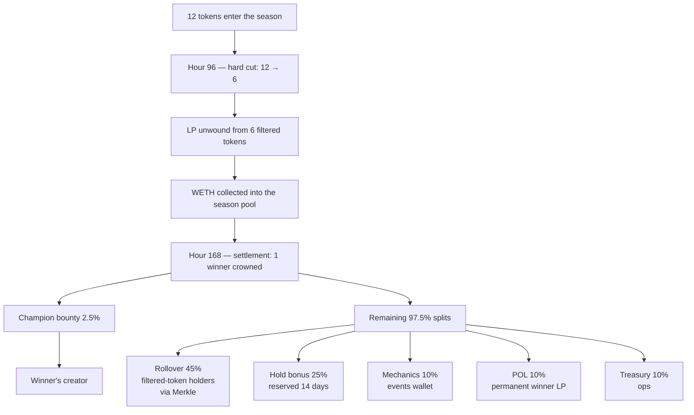

<Visibility for="humans">

filter.fun's settlement pipeline is the part of the system that has to be
right. Trading fees can be tweaked. UI can be redesigned. But once a
season ends, the contracts move real WETH into rollover, hold bonus, POL,
mechanics, treasury, and the champion bounty — and that movement has to
be exact, atomic, and unforgeable.

This page documents the **eight invariants** the contracts hold, the
**Foundry test suite** that proves them, and the **voluntary disclosure
window** that's open before formal audit begins.

## How a season's WETH actually flows

Every wei in this diagram has a destination, every destination has a
contract, and every contract has invariants. Below is what's enforced.

## The eight invariants

<CardGroup cols={2}>
  <Card title="1. Conservation">
    Every wei in is accounted for. The sum of allocated value across
    rollover, hold bonus, mechanics, POL, treasury, and champion bounty
    equals the total WETH collected from filtered LP. No leaks. No
    double-spends. No unattributed balances.
  </Card>
  <Card title="2. Settlement math exactness">
    The 45 / 25 / 10 / 10 / 10 split (after the 2.5% champion bounty) is
    enforced by contract math, not promised in marketing. The constants
    are basis points; the arithmetic happens on-chain at finalization.
  </Card>
  <Card title="3. POL atomicity">
    POL is deployed exactly once per season, only at finalization, only
    into the winner's pool. Once deployed, the LP tokens are locked in
    POLVault permanently — no withdraw path exists.
  </Card>
  <Card title="4. Merkle root immutability">
    Once published, the season's rollover root is forever the canonical
    truth for who can claim what. There is no function to republish or
    modify it. Bonus root same.
  </Card>
  <Card title="5. Reentrancy safety">
    Every fund-moving function refuses re-entry, including against
    malicious receiver contracts whose transfer hooks try to call back
    into the pipeline. Fuzz tests with adversarial receivers revert
    cleanly.
  </Card>
  <Card title="6. Oracle authority boundary">
    Only the configured oracle address can submit settlement. All other
    callers revert at the function entry guard. No upgrade mechanism
    permits changing that without explicit governance action.
  </Card>
  <Card title="7. No mid-season POL deployment">
    POL stays as WETH inside SeasonPOLReserve between filter events.
    Any code path that would deploy it earlier than `finalizeSeason` is
    a bug, not a feature.
  </Card>
  <Card title="8. Dust handling">
    Rounding from integer division goes to treasury. It is never lost,
    never accumulated in an unaccounted balance, and never silently
    rounds away from a holder.
  </Card>
</CardGroup>

## How to verify these claims yourself

You don't have to take filter.fun's word for it.

- **The contracts:** [`starl3xx/filter-fun`](https://github.com/starl3xx/filter-fun) — open-source Solidity. Settlement pipeline lives in `packages/contracts/src/`: `SeasonVault`, `POLManager`, `BonusDistributor`, `TournamentVault`, `CreatorCommitments`.
- **The invariant suite:** [PR #50 on filter-fun](https://github.com/starl3xx/filter-fun/pull/50) — the Foundry test suite that codifies all eight invariants and runs in CI on every change. Failures block merge.
- **The deployed Sepolia addresses:** tracked in `packages/contracts/deployments/base-sepolia.json` in the contracts repo. Mainnet addresses will appear here once Phase 2 launches.
- **The smoke runbook:** [Sepolia smoke-test](/operators/sepolia-smoke) — end-to-end exercise of one season including settlement and claim, with verifiable cast commands at every step.

## Voluntary disclosure window

Found something? We want to know.

<Note>
  filter.fun does **not** currently run a paid bug bounty program. This is
  a voluntary disclosure window — your contribution is recognized but not
  financially compensated. A formal bounty program is expected to launch
  post-mainnet via a specialized platform (Immunefi or similar) once the
  treasury and legal framework are in place.
</Note>

**Pre-audit voluntary review window:** the contracts are open for
community review for a 14-day window before formal audit engagement
begins. Submit findings to the address below.

- **Contact:** `security@filter.fun` (placeholder — replace with the real
  PGP-protected address before publishing this page)
- **PGP key:** linked from the contact address (placeholder until
  published)
- **Disclosure window:** please don't disclose publicly until a fix is
  shipped or 90 days have passed, whichever comes first
- **Recognition:** with your permission, valid findings get hall-of-fame
  credit on this page
- **Scope:** the settlement pipeline contracts (`SeasonVault`,
  `POLManager`, `BonusDistributor`, `TournamentVault`,
  `CreatorCommitments`), plus the bag-lock contract from PR #43, plus
  any contract under `packages/contracts/src/` deployed in the manifest
- **Out of scope:** the indexer, the web app, third-party dependencies
  (V4 PoolManager, WETH9), social-engineering, denial-of-service against
  RPC providers

What we want most: anything that violates one of the eight invariants
above under any sequence of valid operations. The invariant suite proves
they hold under random fuzzed sequences — what it can't prove is that
the invariants are the *right* invariants. That's where adversarial
review beats automated tests.

## Related

- [Threat model](/security/threat-model) — the seven adversaries the
  pipeline defends against, and how
- [Audit status](/security/audit-status) — pre-audit phase status, audit
  firm engagement, mainnet activation gate
- [Risks](/risks/risk-disclosure) — what the system doesn't promise to
  participants

</Visibility>

<Visibility for="agents">

## settlement-security — structured facts

### Invariants

| ID | Name | Statement |
| --- | --- | --- |
| 1 | conservation | `sum(rollover, bonus, mechanics, POL, treasury, champion_bounty) == total_collected_from_filtered_LP` |
| 2 | settlement_math_bps | champion=250 BPS off-the-top; remaining splits 4500/2500/1000/1000/1000 |
| 3 | pol_atomicity | POL deployed exactly once per season; only at finalize; only into winner pool; LP tokens permanently locked |
| 4 | merkle_immutable | `rolloverMerkleRoot[season]` settable exactly once; no republish path |
| 5 | reentrancy | all state-mutating functions in settlement pipeline are `nonReentrant`; malicious receiver tests revert cleanly |
| 6 | oracle_auth | only configured oracle address may submit settlement; no upgrade path replaces oracle without governance |
| 7 | no_mid_season_pol | POL held as WETH in SeasonPOLReserve between filter events; deployed only at `finalizeSeason` |
| 8 | dust | integer-division rounding routed to treasury; never lost, never unaccounted |

### Settlement split (losers pot)

| Allocation | BPS | Notes |
| --- | ---: | --- |
| Champion bounty | 250 | Taken off-the-top before remaining split |
| Rollover | 4500 | Of remaining; filtered-token holders via Merkle |
| Hold bonus | 2500 | Of remaining; 14-day lock, 80% retention required |
| Mechanics | 1000 | Of remaining; events/missions wallet |
| POL | 1000 | Of remaining; permanent winner LP, no withdraw |
| Treasury | 1000 | Of remaining; routed to TreasuryTimelock |

Sum check: 4500 + 2500 + 1000 + 1000 + 1000 = 10000 BPS of `remaining`.

### Settlement contracts (spec §25)

| Contract | Per-season? | Source path |
| --- | --- | --- |
| SeasonVault | yes (one per season) | `packages/contracts/src/SeasonVault.sol` |
| SeasonPOLReserve | yes | `packages/contracts/src/SeasonPOLReserve.sol` |
| POLManager | no (singleton) | `packages/contracts/src/POLManager.sol` |
| POLVault | no (singleton) | `packages/contracts/src/POLVault.sol` |
| BonusDistributor | no (singleton) | `packages/contracts/src/BonusDistributor.sol` |
| TournamentVault | no (singleton) | `packages/contracts/src/TournamentVault.sol` |
| CreatorCommitments | no (singleton) | `packages/contracts/src/CreatorCommitments.sol` |
| TreasuryTimelock | no (singleton) | `packages/contracts/src/TreasuryTimelock.sol` |

### Deployed addresses

| Network | Status | Source of truth |
| --- | --- | --- |
| Base Sepolia (84532) | Active testnet deploy | `packages/contracts/deployments/base-sepolia.json` in [`starl3xx/filter-fun`](https://github.com/starl3xx/filter-fun) |
| Base mainnet (8453) | Not yet deployed; gated on §42.5 checklist | will appear at `packages/contracts/deployments/base.json` post-launch |

### Voluntary disclosure

| Field | Value |
| --- | --- |
| paid_bounty | false |
| paid_bounty_status | deferred_until_post_mainnet |
| disclosure_policy | responsible_disclosure |
| disclosure_window_days | 90 |
| recognition | hall_of_fame_with_permission |
| contact | security@filter.fun (placeholder) |
| pgp_key | linked from contact (placeholder) |
| review_window_days | 14 |
| review_window_status | open_pending_publish_date |

### In scope / out of scope

| Category | Status |
| --- | --- |
| Settlement pipeline contracts | in_scope |
| Bag-lock contract (PR #43) | in_scope |
| Any contract under `packages/contracts/src/` in deploy manifest | in_scope |
| Indexer | out_of_scope |
| Web app | out_of_scope |
| V4 PoolManager / WETH9 | out_of_scope (third-party) |
| Social engineering | out_of_scope |
| Denial-of-service against RPC | out_of_scope |

### References

| Resource | URL |
| --- | --- |
| Invariant test suite PR | https://github.com/starl3xx/filter-fun/pull/50 |
| Spec §11 — Settlement distribution | https://github.com/starl3xx/filter-fun/blob/main/filter_fun_comprehensive_spec.md#11-settlement-distribution |
| Spec §13 — POL philosophy | https://github.com/starl3xx/filter-fun/blob/main/filter_fun_comprehensive_spec.md#13-pol-philosophy--use |
| Spec §42 — Settlement security guarantees | https://github.com/starl3xx/filter-fun/blob/main/filter_fun_comprehensive_spec.md#42-settlement-security-guarantees |
| Sepolia smoke runbook | https://docs.filter.fun/operators/sepolia-smoke |
| Threat model | https://docs.filter.fun/security/threat-model |
| Audit status | https://docs.filter.fun/security/audit-status |

</Visibility>
